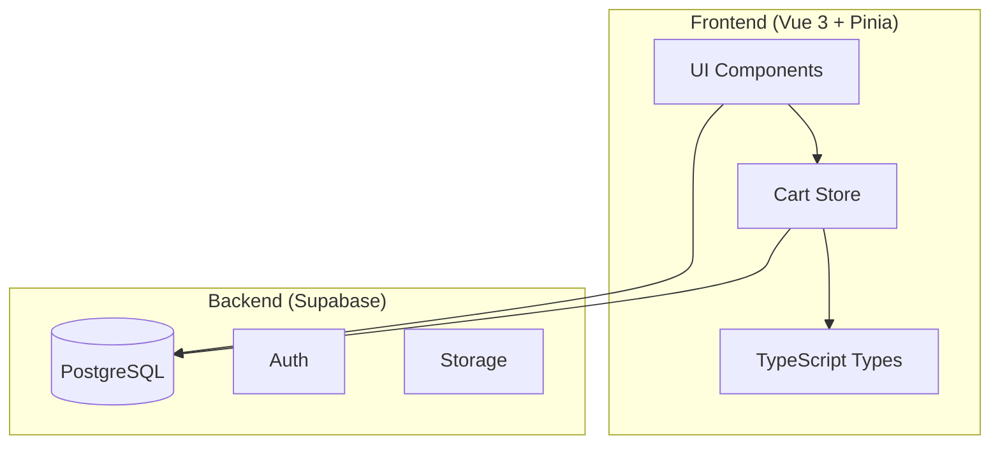
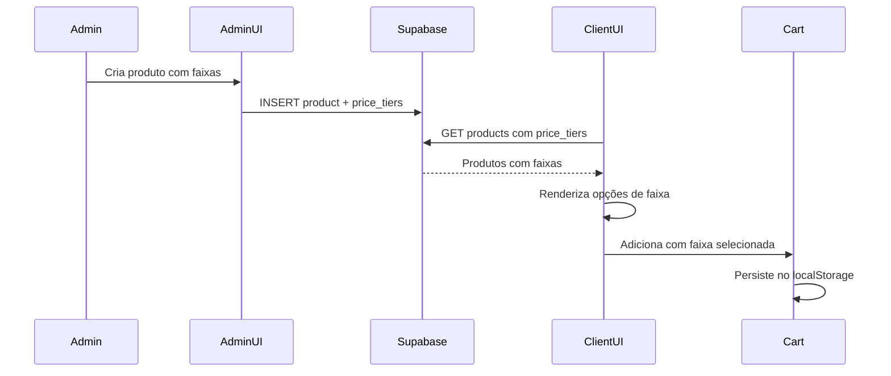
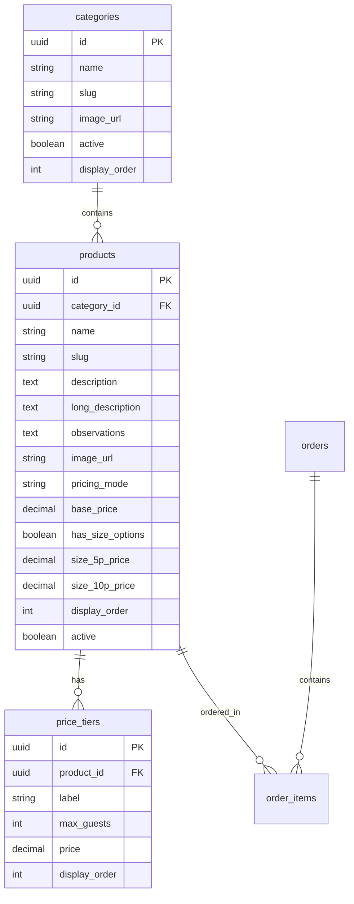

# Design Document: Sistema de Buffet Genérico

## Overview

Este documento descreve o design técnico para transformar o sistema de cardápio de Natal Affetto em um sistema de buffet genérico. A arquitetura mantém a stack existente (Vue 3 + TypeScript + Pinia + Supabase) enquanto expande o modelo de dados para suportar preços por faixa de convidados e preços unitários.

### Objetivos Principais

1. Implementar modelo de preços flexível (faixas de convidados + unitário)
2. Expandir estrutura de produtos com descrições ricas e observações
3. Adaptar carrinho para novos tipos de precificação
4. Remover branding natalino e tornar sistema genérico
5. Manter compatibilidade com dados existentes

## Architecture

### Visão Geral do Sistema



### Fluxo de Dados - Preços por Faixa



## Components and Interfaces

### Novos Tipos TypeScript

```typescript
// Faixa de preço por quantidade de convidados
export type PriceTier = {
  id: string
  product_id: string
  label: string           // Ex: "Até 50 Convidados"
  max_guests: number      // Ex: 50
  price: number           // Ex: 6500.00
  display_order?: number
}

// Produto expandido para buffet
export type BuffetProduct = {
  id: string
  category_id: string
  name: string
  slug?: string
  description?: string        // Descrição curta
  long_description?: string   // Descrição longa com listas
  observations?: string       // Observações (ex: "Bebidas alcoólicas a consultar")
  image_url?: string
  
  // Modo de preço
  pricing_mode: 'unit' | 'tiers' | 'both'
  base_price?: number         // Para modo unitário
  
  // Campos legados (compatibilidade)
  has_size_options?: boolean
  size_5p_price?: number
  size_10p_price?: number
  
  display_order?: number
  active: boolean
  created_at?: string
  updated_at?: string
  
  // Relacionamento
  price_tiers?: PriceTier[]
}

// Item do carrinho adaptado
export type BuffetCartItem = {
  productId: string
  name: string
  image_url?: string
  
  // Para produtos com faixa
  priceTierId?: string
  tierLabel?: string
  tierPrice?: number
  
  // Para produtos unitários
  unitPrice?: number
  quantity: number
  
  // Campos legados
  sizeLabel?: string
  
  subtotal: number
}
```

### Componentes Vue Modificados

#### ProductCard.vue (Expandido)

```typescript
// Props
interface Props {
  product: BuffetProduct
}

// Computed
const priceTiers = computed<PriceTier[] | null>(() => {
  if (props.product.pricing_mode === 'unit') return null
  return props.product.price_tiers?.length ? props.product.price_tiers : null
})

const hasUnitPrice = computed(() => {
  return props.product.pricing_mode === 'unit' || 
         props.product.pricing_mode === 'both'
})

// Methods
const selectTier = (tier: PriceTier) => {
  cart.addWithTier(props.product, tier)
}

const addUnit = () => {
  cart.addUnit(props.product)
}
```

#### AdminProducts.vue (Expandido)

Interface para gerenciar faixas de preço dinamicamente:

```typescript
// Estado local para faixas em edição
const editingTiers = ref<PriceTier[]>([])

// Adicionar nova faixa
const addTier = () => {
  editingTiers.value.push({
    id: crypto.randomUUID(),
    product_id: editing.value?.id || '',
    label: '',
    max_guests: 0,
    price: 0,
    display_order: editingTiers.value.length
  })
}

// Remover faixa
const removeTier = (index: number) => {
  editingTiers.value.splice(index, 1)
}

// Salvar produto com faixas
const saveWithTiers = async () => {
  // 1. Salvar produto
  // 2. Deletar faixas antigas
  // 3. Inserir novas faixas
}
```

### Cart Store Adaptado

```typescript
// src/store/cart.ts
export const useCartStore = defineStore('cart', {
  state: (): { items: BuffetCartItem[] } => ({
    items: JSON.parse(localStorage.getItem('cart') || '[]')
  }),
  
  getters: {
    count: (s) => s.items.reduce((n, i) => n + i.quantity, 0),
    total: (s) => s.items.reduce((sum, i) => sum + i.subtotal, 0),
  },
  
  actions: {
    // Adicionar com faixa de convidados
    addWithTier(product: BuffetProduct, tier: PriceTier) {
      const key = `${product.id}-tier-${tier.id}`
      const existing = this.items.find(i => 
        i.productId === product.id && i.priceTierId === tier.id
      )
      
      if (existing) {
        // Faixas não acumulam quantidade, apenas substitui
        return
      }
      
      this.items.push({
        productId: product.id,
        name: product.name,
        image_url: product.image_url,
        priceTierId: tier.id,
        tierLabel: tier.label,
        tierPrice: tier.price,
        quantity: 1,
        subtotal: tier.price
      })
      this.persist()
    },
    
    // Adicionar produto unitário
    addUnit(product: BuffetProduct) {
      const existing = this.items.find(i => 
        i.productId === product.id && !i.priceTierId && !i.sizeLabel
      )
      
      if (existing) {
        existing.quantity += 1
        existing.subtotal = existing.quantity * (existing.unitPrice || 0)
      } else {
        this.items.push({
          productId: product.id,
          name: product.name,
          image_url: product.image_url,
          unitPrice: product.base_price,
          quantity: 1,
          subtotal: product.base_price || 0
        })
      }
      this.persist()
    },
    
    // Compatibilidade com sistema legado
    add(product: Product, size?: SizeOption) {
      // Mantém lógica atual para produtos antigos
    }
  }
})
```

## Data Models

### Schema do Banco de Dados (Supabase/PostgreSQL)

#### Tabela: products (Modificada)

```sql
ALTER TABLE products 
ADD COLUMN IF NOT EXISTS long_description TEXT,
ADD COLUMN IF NOT EXISTS observations TEXT,
ADD COLUMN IF NOT EXISTS pricing_mode VARCHAR(10) DEFAULT 'unit' 
  CHECK (pricing_mode IN ('unit', 'tiers', 'both'));

COMMENT ON COLUMN products.pricing_mode IS 
  'unit: preço unitário, tiers: faixas de convidados, both: ambos';
```

#### Tabela: price_tiers (Nova)

```sql
CREATE TABLE IF NOT EXISTS price_tiers (
  id UUID PRIMARY KEY DEFAULT gen_random_uuid(),
  product_id UUID NOT NULL REFERENCES products(id) ON DELETE CASCADE,
  label VARCHAR(100) NOT NULL,
  max_guests INTEGER NOT NULL,
  price DECIMAL(10,2) NOT NULL,
  display_order INTEGER DEFAULT 0,
  created_at TIMESTAMPTZ DEFAULT NOW(),
  updated_at TIMESTAMPTZ DEFAULT NOW()
);

CREATE INDEX idx_price_tiers_product ON price_tiers(product_id);

-- Trigger para updated_at
CREATE OR REPLACE FUNCTION update_price_tiers_updated_at()
RETURNS TRIGGER AS $$
BEGIN
  NEW.updated_at = NOW();
  RETURN NEW;
END;
$$ LANGUAGE plpgsql;

CREATE TRIGGER price_tiers_updated_at
  BEFORE UPDATE ON price_tiers
  FOR EACH ROW
  EXECUTE FUNCTION update_price_tiers_updated_at();
```

#### RLS Policies

```sql
-- Leitura pública das faixas de preço
CREATE POLICY "price_tiers_select_policy" ON price_tiers
  FOR SELECT USING (true);

-- Apenas admins podem modificar
CREATE POLICY "price_tiers_insert_policy" ON price_tiers
  FOR INSERT WITH CHECK (auth.role() = 'authenticated');

CREATE POLICY "price_tiers_update_policy" ON price_tiers
  FOR UPDATE USING (auth.role() = 'authenticated');

CREATE POLICY "price_tiers_delete_policy" ON price_tiers
  FOR DELETE USING (auth.role() = 'authenticated');
```

### Diagrama ER




## Correctness Properties

*Uma propriedade é uma característica ou comportamento que deve ser verdadeiro em todas as execuções válidas de um sistema - essencialmente, uma declaração formal sobre o que o sistema deve fazer. Propriedades servem como ponte entre especificações legíveis por humanos e garantias de corretude verificáveis por máquina.*

### Property 1: Persistência de Faixas de Preço (Round-Trip)

*Para qualquer* produto com N faixas de preço, salvar o produto e recarregá-lo do banco de dados deve retornar exatamente as mesmas N faixas com os mesmos valores de label, max_guests e price.

**Validates: Requirements 1.1, 1.4, 4.3, 4.4**

### Property 2: Validação de Campos Obrigatórios em Faixas

*Para qualquer* tentativa de criar uma Faixa_Preco, se label estiver vazio OU max_guests for <= 0 OU price for <= 0, então a operação deve ser rejeitada com erro de validação.

**Validates: Requirements 1.2, 4.2, 4.5**

### Property 3: Cálculo de Subtotal para Produtos Unitários

*Para qualquer* item do carrinho com preço unitário, o subtotal deve ser igual a unitPrice multiplicado por quantity.

**Validates: Requirements 2.4**

### Property 4: Cálculo do Total do Carrinho

*Para qualquer* carrinho com N itens, o total deve ser igual à soma de todos os subtotals dos itens.

**Validates: Requirements 5.4**

### Property 5: Integridade de Adição com Faixa de Preço

*Para qualquer* produto com faixas de preço e qualquer faixa selecionada, após adicionar ao carrinho, o item deve conter priceTierId igual ao id da faixa e tierPrice igual ao price da faixa.

**Validates: Requirements 5.1, 6.5**

### Property 6: Incremento de Quantidade para Produtos Unitários

*Para qualquer* produto unitário adicionado ao carrinho múltiplas vezes, a quantidade deve incrementar e o subtotal deve ser recalculado corretamente.

**Validates: Requirements 2.3, 5.2**

### Property 7: Preservação de Formatação em Descrições

*Para qualquer* string de descrição contendo quebras de linha (\n) ou caracteres de lista (- ou *), a renderização deve preservar esses caracteres na saída.

**Validates: Requirements 3.1, 3.3, 6.3**

### Property 8: Compatibilidade com Modelo Legado

*Para qualquer* produto que possui has_size_options=true com size_5p_price e/ou size_10p_price definidos, o sistema deve renderizar as opções de tamanho corretamente e permitir adição ao carrinho.

**Validates: Requirements 8.1, 8.2, 8.3**

### Property 9: Priorização do Novo Modelo de Preços

*Para qualquer* produto que possui tanto price_tiers (novo modelo) quanto size_5p_price/size_10p_price (modelo legado), o sistema deve exibir apenas as price_tiers para o cliente.

**Validates: Requirements 8.5**

### Property 10: Persistência do Carrinho (Round-Trip)

*Para qualquer* carrinho com itens (faixas ou unitários), persistir no localStorage e recarregar deve retornar exatamente os mesmos itens com os mesmos valores.

**Validates: Requirements 5.5**

## Error Handling

### Erros de Validação no Admin

| Cenário | Tratamento |
|---------|------------|
| Faixa sem label | Exibir "Label é obrigatório" e impedir salvamento |
| Faixa com max_guests <= 0 | Exibir "Quantidade de convidados deve ser maior que zero" |
| Faixa com price <= 0 | Exibir "Preço deve ser maior que zero" |
| Produto sem nome | Exibir "Nome é obrigatório" |
| Erro de conexão Supabase | Exibir toast de erro e permitir retry |

### Erros no Carrinho

| Cenário | Tratamento |
|---------|------------|
| Produto não encontrado | Remover item inválido do carrinho silenciosamente |
| localStorage indisponível | Manter carrinho apenas em memória |
| Dados corrompidos no localStorage | Limpar carrinho e iniciar vazio |

### Erros de Carregamento

| Cenário | Tratamento |
|---------|------------|
| Falha ao carregar produtos | Exibir estado de erro com botão de retry |
| Falha ao carregar faixas | Exibir produto sem opções de faixa |
| Timeout de conexão | Usar dados em cache se disponíveis |

## Testing Strategy

### Abordagem de Testes

O sistema utilizará uma abordagem dual de testes:

1. **Testes Unitários**: Para exemplos específicos, edge cases e condições de erro
2. **Testes de Propriedade (Property-Based Testing)**: Para validar propriedades universais com inputs gerados

### Biblioteca de Property-Based Testing

Utilizaremos **fast-check** para TypeScript/JavaScript, que é a biblioteca mais madura para PBT no ecossistema Vue/TypeScript.

```bash
npm install --save-dev fast-check
```

### Configuração de Testes de Propriedade

- Mínimo de 100 iterações por teste de propriedade
- Cada teste deve referenciar a propriedade do design document
- Formato de tag: **Feature: buffet-menu-system, Property N: [título]**

### Testes Unitários

| Área | Testes |
|------|--------|
| Cart Store | Adicionar item unitário, adicionar com faixa, remover item, limpar carrinho |
| Validação | Campos obrigatórios, valores inválidos, edge cases |
| Renderização | Produto com faixas, produto unitário, produto legado |
| Compatibilidade | Produtos antigos, migração de dados |

### Testes de Propriedade

| Property | Descrição | Generators |
|----------|-----------|------------|
| 1 | Round-trip de faixas | Produto arbitrário, N faixas arbitrárias |
| 2 | Validação de faixas | Faixas com campos inválidos |
| 3 | Subtotal unitário | Preço arbitrário, quantidade arbitrária |
| 4 | Total do carrinho | N itens arbitrários |
| 5 | Adição com faixa | Produto com faixas, faixa selecionada |
| 6 | Incremento quantidade | Produto unitário, N adições |
| 7 | Preservação formatação | Strings com \n e caracteres de lista |
| 8 | Compatibilidade legada | Produtos com modelo antigo |
| 9 | Priorização modelo | Produtos com ambos os modelos |
| 10 | Round-trip carrinho | Carrinho com itens mistos |

### Exemplo de Teste de Propriedade

```typescript
import fc from 'fast-check'
import { useCartStore } from '../store/cart'

// Feature: buffet-menu-system, Property 3: Cálculo de Subtotal para Produtos Unitários
describe('Cart subtotal calculation', () => {
  it('subtotal equals unitPrice * quantity for any values', () => {
    fc.assert(
      fc.property(
        fc.float({ min: 0.01, max: 10000 }),  // unitPrice
        fc.integer({ min: 1, max: 100 }),      // quantity
        (unitPrice, quantity) => {
          const subtotal = unitPrice * quantity
          expect(subtotal).toBeCloseTo(unitPrice * quantity, 2)
        }
      ),
      { numRuns: 100 }
    )
  })
})

// Feature: buffet-menu-system, Property 4: Cálculo do Total do Carrinho
describe('Cart total calculation', () => {
  it('total equals sum of all subtotals', () => {
    fc.assert(
      fc.property(
        fc.array(fc.float({ min: 0.01, max: 10000 }), { minLength: 0, maxLength: 20 }),
        (subtotals) => {
          const total = subtotals.reduce((sum, s) => sum + s, 0)
          const expectedTotal = subtotals.reduce((sum, s) => sum + s, 0)
          expect(total).toBeCloseTo(expectedTotal, 2)
        }
      ),
      { numRuns: 100 }
    )
  })
})
```

### Cobertura de Requisitos

| Requisito | Testes Unitários | Testes de Propriedade |
|-----------|------------------|----------------------|
| 1 (Faixas) | CRUD básico | Property 1, 2 |
| 2 (Unitário) | Adição simples | Property 3, 6 |
| 3 (Estrutura) | Renderização | Property 7 |
| 4 (Admin) | Formulário | Property 1, 2 |
| 5 (Carrinho) | Operações | Property 3, 4, 5, 6, 10 |
| 6 (Exibição) | Componentes | Property 5, 7 |
| 7 (Branding) | Textos | Verificação manual |
| 8 (Migração) | Legado | Property 8, 9 |
